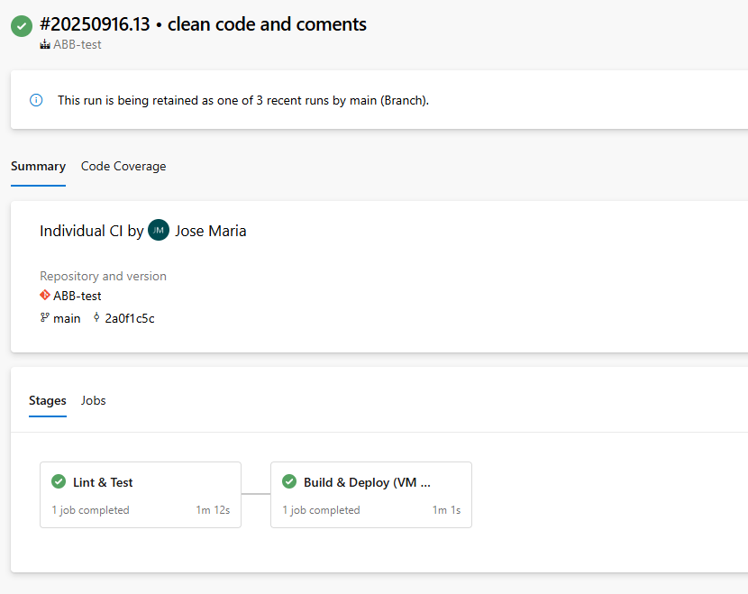
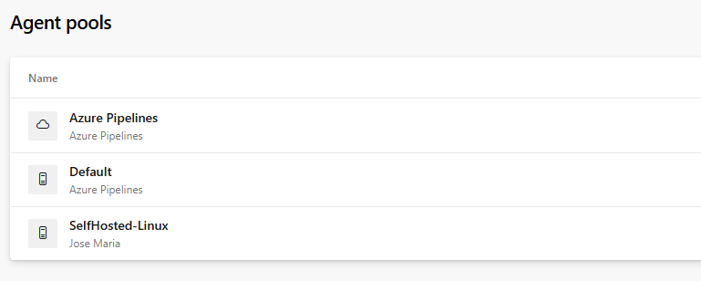
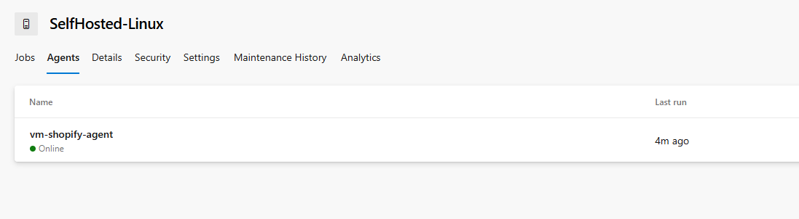
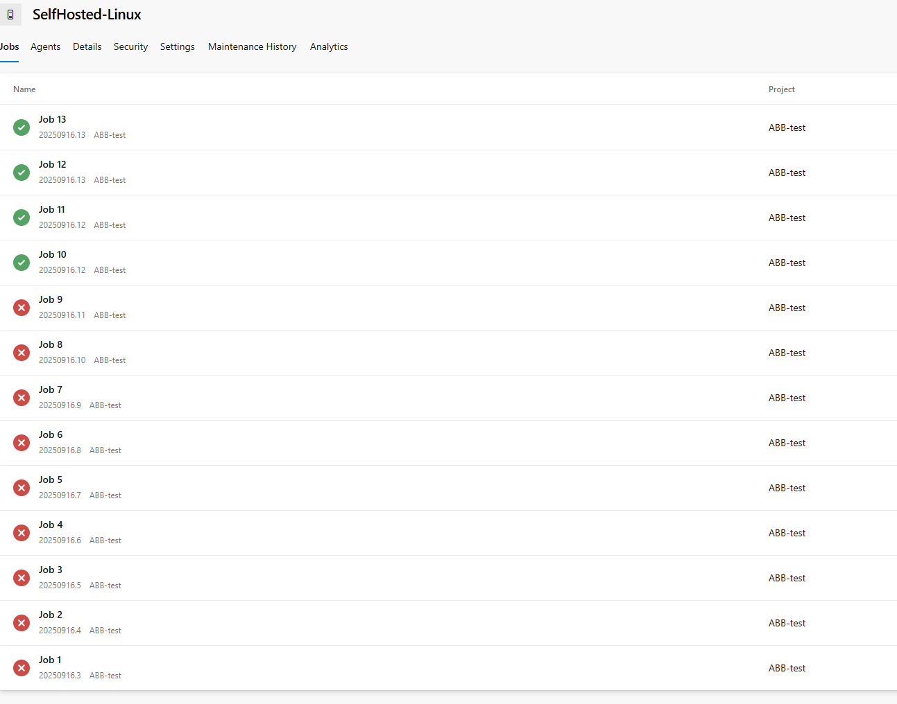
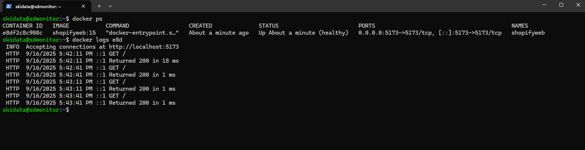

# Shopify Demo — Vite + React + Cypress + Azure Pipelines

Proyecto de ejemplo tipo e-commerce con Vite + React + TypeScript y pruebas E2E con Cypress.
Incluye Dockerfile, docker-compose y pipeline de Azure DevOps con etapas de linting, testing y deploy a un entorno de pruebas (contenedor Docker en el propio agente).

## Stack

Frontend: Vite, React, TypeScript, Tailwind

Tests E2E: Cypress 13 (Electron headless en CI)

CI/CD: Azure DevOps Pipelines (agente Linux self-hosted)

Contenedores: Docker

## Scripts de npm
```bash
  npm install              # instala dependencias
  npm run dev         # entorno de desarrollo (Vite)
  npm run build       # build de producción (dist/)
  npm run lint        # ESLint
```

## Ejecutar la app en local
```bash
npm ci
npm run dev
# abre http://localhost:5173
```

## Tests E2E (Cypress)
```bash
npx cypress run
```

## Nota sobre el modal inicial

Esta app muestra un modal/overlay al entrar. Para que los tests no fallen, se añadieron comandos personalizados en cypress/support/commands.ts:

cy.dismissLandingModal() – intenta cerrar el modal (botón/ESC)

cy.ensureNoModal() – limpieza agresiva (oculta/elimina overlays típicos: Tailwind fixed/inset-0/bg-opacity-*, ReactModal, Swal, Ant, etc.)

Overwrite de cy.visit() que inyecta flags en localStorage/cookies para no mostrar el modal cuando sea posible.

Los specs usan cy.ensureNoModal() antes de clics críticos (p. ej. login) y, en CI, se fuerza el click ({ force: true }) para neutralizar transiciones.

# Docker

## Build & run
```bash
docker build -t shopifyweb:local .
docker run -d --name shopifyweb -p 5173:5173 shopifyweb:local
```

## docker compose
```bash
docker compose up --build -d
# http://localhost:5173
```

# CI/CD en Azure DevOps

El pipeline está definido en azure-pipelines.yml y tiene dos stages:

## 1 Lint_Test
- Usa Node 20.x
- npm ci + npm run lint
- npm run build
- Arranca vite preview en background (puerto 5173), espera con wait-on
- Ejecuta Cypress en Electron headless bajo Xvfb
- Limpieza garantizada con trap (mata el preview aunque fallen los tests)

## 2 Build_And_Deploy (VM Agent)
- Construye la imagen Docker con el Dockerfile
- Reinicia/levanta el contenedor shopifyweb mapeando 5173:5173
- Comprueba que responde; si no, vuelca docker logs y falla

## Screenshots

### Pipeline


### Agent Pool


### Agent


### Retrys


### Probe of work


